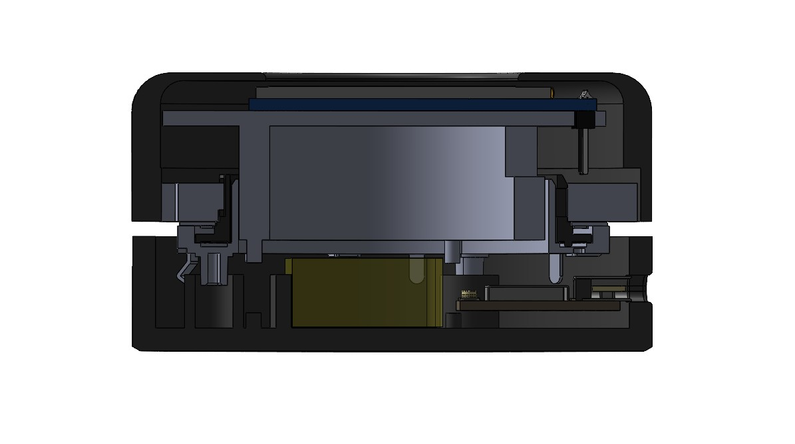

### NOB is a WIP project to address a personal need for a reasonably priced and customizable rotary encoder for audio control. 
---
### Goals ☑️:
  After switching to a brand-new mechanical keyboard, I lost my built-in volume knob and missed the convenience of having a physical dial to control the volume of my music or videos. I wanted to build a wireless device that looks production-ready and has full functionality while maintaining a minimalistic approach and footprint on my small dorm room desk. 

  With some research on existing solutions, I came across the [Smart Knob Project](https://github.com/scottbez1/smartknob) by Scott Bezek (scottbezek1) whose design utilized a flexible software-defined system for encoding and a brilliant implementation of magnetic encoders in tandem with an elegantly designed display. However, the process of designing around a custom PCB and hot-plate soldering made this project less feasible for practical use. Additionally, the high cost to invest in the tools and parts necessary for that project would not be worth it just for a small learning project. As such, I sought out a more traditional encoder-based solution.

Intended Features 💡:
- Round LCD Display for resource and volume monitoring
- Rotary encoder for granular volume/macro control
- Push button functionality for muting and additional functions
- 500 mAh battery life with USB-C charging interface
- Minimalistic puck design and wireless connectivity via Wi-Fi/BT

---
### Prototyping 📝:
  During the prototyping process, the Sparkfun Electronics Kit was used to breadboard components to a RedBoard. At this stage, I do not have access to an ESP32 microcontroller and thus cannot integrate wireless functionality nor can I directly interface with Bluetooth audio controls. As such, I designed this prototype using a python script, taking advantage of the Pycaw library for audio interfacing with Windows. Being unfamiliar with this Pycaw library, I took advantage of Generative AI and various sources of documentation to aid in drafting a basic volume control system that maps the potentiometer's rotation to a 1-100 scale volume value.

  The limitations of the included 330Ω and 10kΩ resistors proved to be inconvenient given the relatively poor quality of the included 16x2 LCD display with the SparkFun kit: The contrast control (Pin3) required a very specific resistance to "optimize" visibility of the backlight and rendered pixels. 

  Typically, this is done through a potentiometer to fine tune the contrast levels through an analog input (as suggested by the included documentation). However, to avoid sourcing any additional parts for this basic drafting phase, I only had access to a single potentiometer which was being occupied as the actual rotary encoder for the volume dial. As a work around, a constant resistance was provided to the pin using a series of 330Ω and 10kΩ resistors to create an equivalent resistance of ~620Ω, which produced a reasonably usable result.

The schematic for the prototype circuit can also be accessed here: 

    The resistors in this prototype can be replaced with an equivalent resistor of approximately 600-620Ω (This may vary depending on the selected LCD display chosen for this project).

---

### Mechanical Design and Part Selection ⚙️:

  The undertaking of designing around space and dimensional constraints was a major challenge. From the start, I understood the difficulty in designing around the concentric LCD display module, given the need to run cables from the display to the board without any entanglement that would result from the rotation of the knob. 

  After multiple iterations of designs and sketches of mechanisms, the standard KY-40 rotary encoder was determined to be suboptimal for the given configuration. If an LCD was mounted above the knob on top of the dial surface, the cables would have to run through the interior of the device and eventually wrap around/tangle on the encoder shaft. The only option for the use of this encoder would be to run the cables for the display externally. This, however, was a design sacrifice that violated the vision and principles of the project and thus eliminated the use of this encoder type entirely. 

  [Sketches of designs 📗](https://github.com/PotatoSlop/Nob/blob/main/docs/images/Ideas.pdf)

  With some research, it was settled that a PER56 ring encoder would suffice for this project. The decision to utilize a ring encoder came from a similar project dubbed the [Focus Dial](https://github.com/sb-ocr/focus-dial) by Salim Benbouziyane (sb-ocr) and Uwe Arzt (uwearzt). 

  Despite the central cavity being optimal for LCD wiring, the opening also means that a built-in push button is not available and must be implemented separately. To power this device, a Seeed Studio Xiao ESP32C6 is used for its support of Bluetooth 5.0, small footprint, sufficient pinouts, and support for battery charging via the USB-C port. To meet the wireless requirement, power is supplied via a standard 500 mAh LiPo battery whose 2-pin JST connection is stripped and the wires fully soldered to the ESP board. To minimize cost and simplify the design, a standard 12 mm push button (the same that is included in the Sparkfun kit) is used for the central push button system. 

---
  The parts can all be found online on various shopping platforms following:
  - Ring Encoder: [Bourns](https://bourns.com/products/encoders/details/contacting-encoders/per56)
  - ESP32C6: [Seeed Studio](https://www.seeedstudio.com/Seeed-Studio-XIAO-ESP32C6-p-5884.html?srsltid=AfmBOoqzKT3pEN_wFq-VWKFG-nFZg51tgOKhKECIqT7EIMbkc1jp4EuUsLw)
  - Push-button: [SparkFun](https://www.sparkfun.com/multicolor-buttons-4-pack.html)
  - Springs: [Amazon](https://www.amazon.com/gp/product/B0BVTDP29W/ref=ox_sc_act_title_1?smid=A68J46NETMDFM&th=1)
  - Rubber Feet: [Amazon](https://www.amazon.com/Adhesive-Furniture-Bumpers-Cabinets-AUSTOR/dp/B074C2XKXH/ref=sr_1_6?crid=19UI8D3YPQ274&dib=eyJ2IjoiMSJ9.P-P4Y_hAXU0JP_YewUEa2FbVhspBSJvbAMJh-ZxtYgFEBdBpv3YxqjSLkQn6_c84gHcUDVdvVJ1JwwYbtwFMVnnr4YNLw0cqKKpoxOUmbyDe564pcrrOG0cwv11yGUzRHGUmDGub_37p2rbKvRAkptx8bxv70z5mcr8dvW7D94U0HEINzxxFRlF3XTH3MsxMcaN30QZIOE857FKrxMOTLPcX_ZPas551fXZF8sOL2qvNJWtDPmPLT_7cc8Xm7IzOSHlcL2acrbhprfvq_Lyrwvc2mmAbqtrU2fETqpXzNOE.CfXiQVandTmYE5bAj_TgTMXmWOG6U51l7nASbqEbWhA&dib_tag=se&keywords=rubber+feet&qid=1758152878&sprefix=rubber%2Caps%2C125&sr=8-6)
  - Battery: [Aliexpress](https://www.aliexpress.us/item/3256807154846970.html?spm=a2g0o.cart.0.0.558e38daOT5NWP&mp=1&pdp_npi=5%40dis%21USD%21USD%208.23%21USD%205.02%21%21USD%205.02%21%21%21%40210318c317581527531163540e2356%2112000040337684710%21ct%21US%213133890330%21%211%210&gatewayAdapt=glo2usa)
  - TFT LCD Display (1.28in): [Aliexpress](https://www.aliexpress.us/item/3256808111907531.html?spm=a2g0o.cart.0.0.558e38daOT5NWP&mp=1&pdp_npi=5%40dis%21USD%21USD%2010.25%21USD%2010.25%21%21USD%2010.25%21%21%21%40210318c317581527531163540e2356%2112000044536633369%21ct%21US%213133890330%21%211%210&gatewayAdapt=glo2usa)

The bill of materials for this project comes out to just under **$50 USD** without the 3D printed components. _(This may vary depending on where parts are sourced and the shipping costs to your area)_

